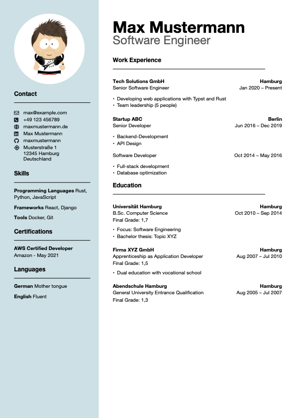
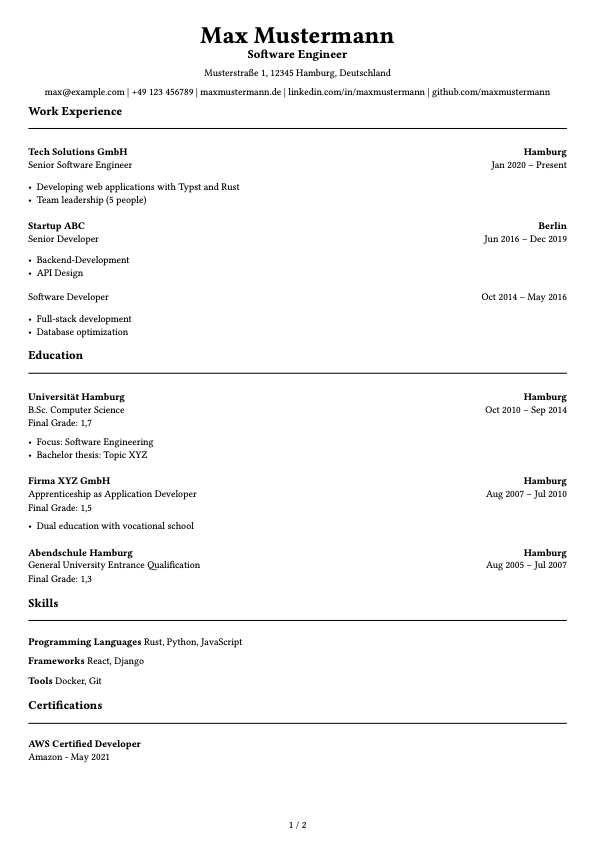

# Double CV Template

This project features two templates for a curriculum vitae (CV) using [Typst](https://github.com/typst/typst) for compilation and YAML to store your data. This way you only have to enter your data once and can create multiple documents from it.

This project also features multi-language support (currently English and German).

## Usage

This project is inteded to be used via the commant line. You can either specify the language and the template via arguments or use the defaults in `main.typ`.

Specifying arguments:
```bash
typst c main.typ <output file>.pdf --input template=<ats | modern> --input lang=<en | de>
```

Using the defaults:
```bash
typst c main.typ
```

For instructions on how to enter your personal data, please refer to [Datastructure](#datastructure) section below.

## Examples

### Modern template

This is an example for the `modern.typ` template.



### ATS-optimized template

This is an example for the `ats.typ` template.



## Datastructure

In order to have all necessary data centralized, and therefore prevent to have to manually enter the same data in multiple locations, this project uses [YAML](./data/cv.yaml).

Some fields feature support for multiple languages (starting with either `de` or `en`) and therefore require a translation. If you don't need multiple languages though, the templates will work just fine without it.

Following are extensive explanantions on the structure and values of each block within the file.

### Personal data

```yaml
person:
  first_name: "Your first name; used for the header"
  last_name: "Your last name; used for the header"
  title:
    de: "German version of your title to display in the header"
    en: "English version of your title to display in the header"
  date_of_birth: "Your date of birth"   # currently not in use
```

### Contact data

All of these values are conditional and will only be rendered when they are present and there is content other than `null`.
```yaml
contact:
  phone: "Your phone number"
  email: "Your mail address"
  website: "Your website"
  linkedin: 
    url: "Your LinkedIn profile"
    display_text: "How the link should be displayed"
  github:
    url: "Your GitHub profile"
    display_text: "How the link should be displayed"
  address:
    street: "Street and number"
    city: "City"
    postal_code: "Postal code"
    country: "Country of residence"
```

### Work experience

The template features multiple positions within the same company without repeating the company name over and over again.

Entries in this section will be ordered descending by date.

A missing `end_date` or having this value as `null` will result in the rendering as `Present`.
```yaml
experience:
  - company: "Employer"
    website: "Employer's website"
    location: "Employers location"
    positions:
      - position:   # second position at the same company
          de: "German version of your title"
          en: "English version of your title"
        start_date: "When you started at this position; format YYYY-MM"
        end_date: "When you left this position; format YYYY-MM"
        description:
          de:
            - "List of tasks you were assigned or achievements; German"
          en:
            - "List of tasks you were assigned or achievements; English"

      - position:   # first position at the same company
          de: "German version of your title"
          en: "English version of your title"
        start_date: "When you started at this position"
        end_date: "When you left this position"
        description:
          de:
            - "List of tasks you were assigned or achievements; German"
          en:
            - "List of tasks you were assigned or achievements; English"
```

### Education

Entries in this section will be ordered descending by date.

A missing `end_date` or having this value as `null` will result in the rendering as `Present`.
If `end_date` is missing or equal to `null`, `grade` will be rendered as `Current Grade`, `Final Grade` otherwise.
```yaml
education:
  - institution: "School's or university's name"
    website: "School's or university's website"
    degree: 
      de: "Degree you achieved or are trying to achieve; German"
      en: "Degree you achieved or are trying to achieve; English"
    field:
      de: "Field of studies/learning; German"
      en: "Field of studies/learning; English"
    start_date: "When you started; format YYYY-MM"
    end_date: "When you finished; format YYYY-MM"
    location: "Location of school or university"
    grade: "Achieved or current grade"
    details:
      de:
        - "List with details such as attended courses or topic of your thesis; German"
      en:
        - "List with details such as attended courses or topic of your thesis; English"
```

### Skills

You can add as many categories of skills as you like.
They will indivudually listed in the compiled document.
```yaml
skills:
  categories:
    - name:
        de: "Name for the category of skill; German"
        en: "Name for the category of skill; English"
      items:
        - name: "Element for this skill"
```

### Certificates

You can add as many certificates as you like.
They will indivudually listed in the compiled document.
```yaml
certifications:
  - name: "Name of the certificate"
    issuer: "Issuer of the certificate"
    date: "Date of certification; Format YYYY-MM"
```

### Languages

You can add as many languages as you like.
They will indivudually listed in the compiled document.
```yaml
languages:
  - name:
      de: "Name of language; German"
      en: "Name of language; English"
    level:
      de: "Level of proficiency for that language; German"
      en: "Level of proficiency for that language; English"
```
